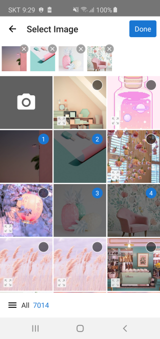
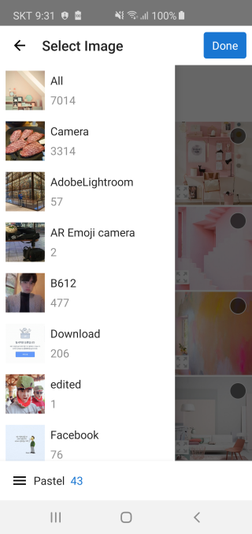
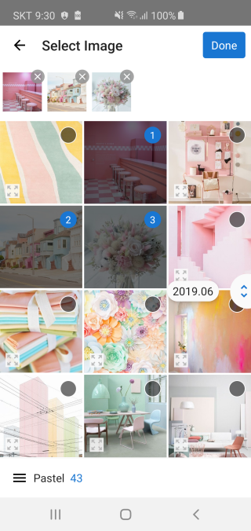
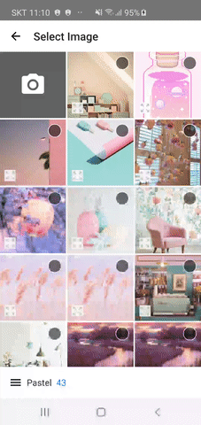

 
# TedImagePicker []( https://android-arsenal.com/details/1/7697 )


TedImagePicker is **simple/beautiful/smart** image picker
- Support Image/Video
- Support Single/Multi select
- Support more configuration option


| Image Select                    | Select Album                     | Scroller                         |
|:------------------------------:|:---------------------------------:|:--------------------------------:|
| | ||


</br></br>
## Demo


| Image Select                    | Select Album                     | Scroller                         |
|:------------------------------:|:---------------------------------:|:--------------------------------:|
| | ||

</br></br>
## Setup


### Gradle
[  ](https://bintray.com/tkdrnjs0912/maven/tedimagepicker/_latestVersion)
```gradle
dependencies {
    implementation 'gun0912.ted:tedimagepicker:x.y.z'
    //implementation 'gun0912.ted:tedimagepicker:1.0.0'
}

```
If you think this library is useful, please press star button at upside. </br>


</br></br>
## How to use

### 1.Enable databinding
- TedImagePicker use databinding
- Set enable databinding in your app `build.gradle`
```
dataBinding {
    enabled = true
}
```
### 2.Start TedImagePicker/TedRxImagePicker
- TedImagePicker support `Listener` and `RxJava`style
#### Listener
##### Single image
- Kotlin
```kotlin
TedImagePicker.with(this)
    .start { uri -> showSingleImage(uri) }
```
- Java
```java
TedImagePicker.with(this)
        .start(new OnSelectedListener() {
            @Override
            public void onSelected(@NotNull Uri uri) {
                showSingleImage(uri);
            }
        });
TedImagePicker.with(this)
        .start(uri -> {
            showSingleImage(uri);
        });        
```

##### Multi image
- Kotlin
```kotlin
TedImagePicker.with(this)
    .startMultiImage { uriList -> showMultiImage(uriList) }
```
- Java
```java
TedImagePicker.with(this)
        .startMultiImage(new OnMultiSelectedListener() {
            @Override
            public void onSelected(@NotNull List<? extends Uri> uriList) {
                showMultiImage(uriList);
            }
        });
TedImagePicker.with(this)
        .startMultiImage(uriList -> {
            showMultiImage(uriList);
        });
```
<br/>

#### RxJava
##### Single image
```kotlin
TedRxImagePicker.with(this)
    .start()
    .subscribe({ uri ->
    }, Throwable::printStackTrace)
```
##### Multi image
```kotlin
TedRxImagePicker.with(this)
    .startMultiImage()
    .subscribe({ uriList ->
    }, Throwable::printStackTrace)
```

</br></br>
## Customize
- You can customize what you want

### Function

#### Common
* `mediaType(MediaType)` : MediaType.IMAGE / MediaType.VIDEO
* `cameraTileBackground(R.color.xxx)`
* `cameraTileImage(R.drawable.xxx)`
* `showCameraTile(Boolean) (default: true)`
* `scrollIndicatorDateFormat(String)(default: YYYY.MM)`
* `title(String or R.string.xxx) (default: 'Select Image','사진 선택')`
* `backButton(R.drawable.xxx)`
* `zoomIndicator(Boolean) (default: true)`
* `image()`
* `video()`


#### Multi Select
* `selectedUri(List<Uri>)`
* `buttonGravity(ButtonGravity)`: You can change `done` button location top or bottom
* `buttonText(String or R.string.xxx) (default: 'Done','완료')`
* `max(Int, String or R.string.xxx)`
* `min(Int, String or R.string.xxx)`
</br></br>


## FAQ
### - Do not need to check permissions?
- Yes, `TedImagePicker` automatically check permission.
: `TedImagePicker` use [TedPermission](https://github.com/ParkSangGwon/TedPermission)
- But If you need You can check permission before start `TedImagePicker`.

### - java.lang.NoClassDefFoundError: Failed resolution of: Landroidx/databinding/DataBinderMapperImpl;
- You have to enable databinding
- Read [this](https://github.com/ParkSangGwon/TedImagePicker/blob/master/README.md#1enable-databinding)


</br></br>
## License 
 ```code
Copyright 2019 Ted Park

Licensed under the Apache License, Version 2.0 (the "License");
you may not use this file except in compliance with the License.
You may obtain a copy of the License at

http://www.apache.org/licenses/LICENSE-2.0

Unless required by applicable law or agreed to in writing, software
distributed under the License is distributed on an "AS IS" BASIS,
WITHOUT WARRANTIES OR CONDITIONS OF ANY KIND, either express or implied.
See the License for the specific language governing permissions and
limitations under the License.```
